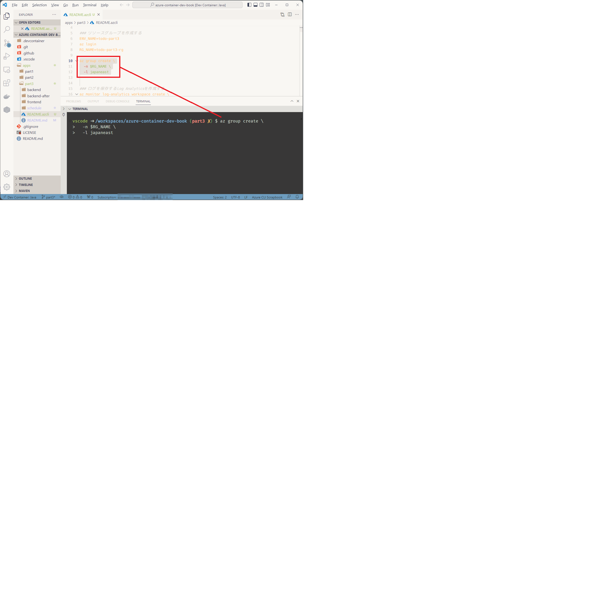

## 1. ディレクトリ構成
本ディレクトリには『Azureコンテナアプリケーション開発』（技術評論社，2023年）の第3部で解説した以下のサンプルが含まれます。

* 第10章: Container Appsでのコンテナアプリケーション開発ハンズオン
* 第11章: Container Appsによるマルチコンテナの運用

```
├── backend (第10章で使用)   
│   ├── src
├── backend-after(第11章で使用)
│   └── src
├── frontend (第10章で使用)
│   ├── public
│   └── src
└── schedule (第10章で使用)
```

## 2. ハンズオンの実施方法
ハンズオンの詳細な手順については、書籍を参照してください。なお書籍中のコマンドは[こちら](README.azcli)にまとめています。

Visual Studio CodeをDevcontainerで開き、[README.azcli](README.azcli) ファイルを開きます。実行したいコマンドを選択した状態で`[Ctrl]` + `[^]`を押下すると、ターミナルに自動でコマンドを入力できます。



